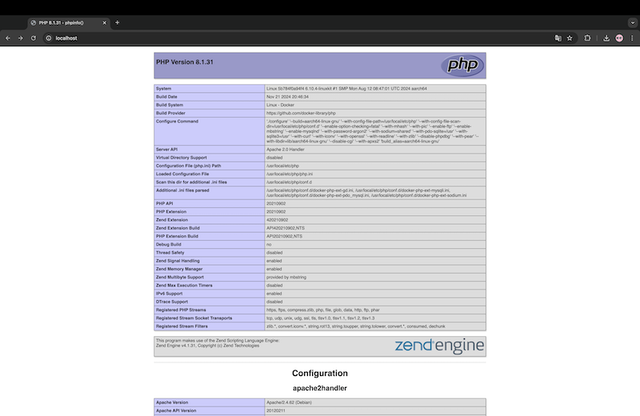
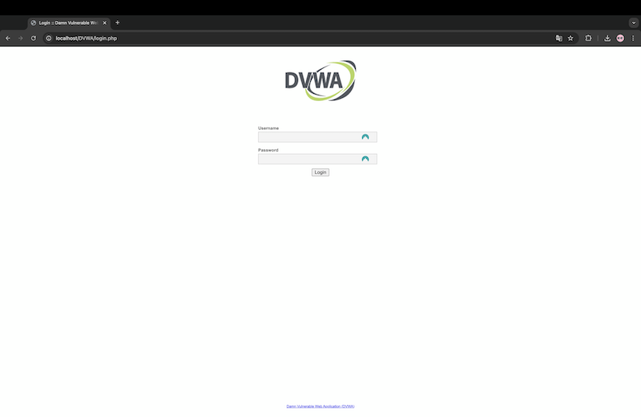
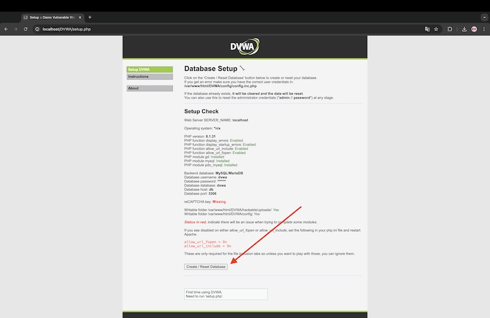
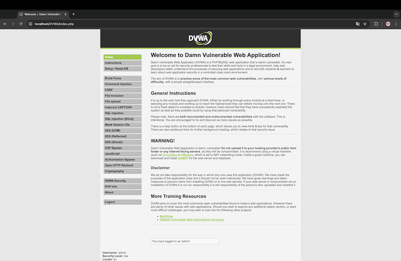

# Projeto DVWA com Docker

Este repositório foi criado como parte de um exercício prático da disciplina **Metodologias de Análise de Vulnerabilidades**, do curso de [MBA em Cyber Security](https://www.impacta.edu.br/mba/cyber-security) da Faculdade Impacta. A disciplina é ministrada pelo professor **Flavio Cunha** e tem como objetivo o desenvolvimento de habilidades técnicas relacionadas à identificação e análise de vulnerabilidades em sistemas.

## Índice

- [Contexto](#contexto)
- [Estrutura do Projeto](#estrutura-do-projeto)
- [Descrição do Projeto Docker](#descrição-do-projeto-docker)
  - [Serviço Web PHP](#1-serviço-web-php)
  - [Banco de Dados (MariaDB)](#2-banco-de-dados-mariadb)
- [Passos para Executar o Projeto](#passos-para-executar-o-projeto)
- [Troubleshooting](#troubleshooting)
  - [Verificação de Conexão com o Banco](#verificação-de-conexão-com-o-banco)
  - [Reiniciando toda configuração](#reiniciando-toda-configuração)
- [Extra: Configuração do reCAPTCHA](#extra-configuração-do-recaptcha)
- [Notas](#notas)
- [Créditos](#créditos)


## Contexto

Este projeto configura o [DVWA (Damn Vulnerable Web Application)](https://github.com/digininja/DVWA.git) utilizando containers Docker, incluindo um servidor web com Apache, PHP e MariaDB. O ambiente para fins didaticos é totalmente configurado para iniciar automaticamente com banco de dados e permissões adequadas.

É um requisito ter o Docker instalado e configurado. Para mais detalhes de instalação acesse a [Documentação Oficial](https://docs.docker.com/engine/install/) do Docker.

## Estrutura do Projeto

```
.
├── docker-compose.yaml       # Configuração do Docker Compose para os serviços web e db
├── db_root_password.txt      # Crie este arquivo com a senha root que será configurada no banco de dados
├── Dockerfile                # Configuração da imagem customizada para o servidor web
├── php.ini                   # Arquivo de configuração do PHP
├── images/                   # Diretório das imagens da documentação
├── web/                      # Diretório para os arquivos da aplicação DVWA
└── db-init/                  # Scripts de inicialização do banco de dados
    └── init.sql              # Criação do banco, usuário e permissões
```
> Atenção: Crie o arquivo db_root_password.txt na raiz do projeto

## Descrição do Projeto Docker
Este projeto esta estruturado em 2 containers

### **1. Serviço Web PHP**
- Imagem base: `php:8.1-apache`
- Volumes:
  - `./web:/var/www/html`: Código da aplicação.
  - `./php.ini:/usr/local/etc/php/php.ini`: Configurações personalizadas do PHP.
- Módulos PHP instalados:
  - `gd`
  - `mysqli`
  - `pdo_mysql`
- Variáveis de ambiente:
  - `DB_SERVER`, `DB_DATABASE`, `DB_USER`, `DB_PASSWORD`, `DB_PORT`.

### **2. Banco de Dados (MariaDB)**
- Imagem: `mariadb:10.3`
- Volumes:
  - `db_data:/var/lib/mysql`: Dados persistentes do banco.
  - `./db-init:/docker-entrypoint-initdb.d`: Scripts SQL de inicialização.
- Variáveis de ambiente:
  - `MYSQL_ROOT_PASSWORD`.

## Passos para Executar o Projeto

1. Clone o repositório:
   ```bash
   git clone https://github.com/luoldrigues/Docker-DVWA
   cd Docker-DVWA
   ```

2. Crie o arquivo db_root_password.txt na raiz do projeto. Nesse exemplo a senha será `PASSWORD`.
   ```sh
   echo "PASSWORD" > db_root_password.txt
   ```

3. Suba os containers:
   ```bash
   ./deploy.sh
   ```

4. Acesse a aplicação no navegador.

  - URL: `http://localhost`

  

5. Acesse a pasta DVWA `http://localhost/DVWA` e digite as credenciais

  - Usuario: `admin`
  - Senha: `password`

  

6. Clique no botão `Create / Reset Database`.

 

7. Digite novamente as credenciais

  - Parabéns! Tudo pronto! Ótimos estudos!

  


## Troubleshooting

### Verificação de Conexão com o Banco

Acesse o MariaDB manualmente para confirmar que o banco e as permissões foram criados:
```bash
docker exec -it mariadb mysql -u root -p
```
> Obs: A senha do usuario root é a senha que voce adicionou no arquivo `db_root_password.txt` na raiz do projeto.


### Reiniciando toda configuração

1. Se precisar reiniciar toda configuração, acesse o arquivo deploy.sh e descomente as linhas abaixo.
```sh
# Descomente as linhas abaixo para apagar containers antigos se der algum problema
echo "Apagando Containers Antigos"
docker compose -f docker-compose.yaml down -v
wait
```

2. Agora vamos executar o deploy. Abra o terminal na pasta do projeto e execute o comando abaixo.
```sh
./deploy.sh
```

3. Lembre-se de comentar as linhas novamente após a execução do deploy.sh, caso contrario a cada novo deploy todas as alterações serão apagadas.

## Extra
### Configuração do reCAPTCHA

Para utilizar o recurso de reCAPTCHA na aplicação:
1. Gere as chaves no site do [Google reCAPTCHA](https://www.google.com/recaptcha/admin).
2. Defina as chaves no arquivo `docker-compose.yaml`:
   ```yaml
   environment:
     RECAPTCHA_PUBLIC_KEY: "SUA_CHAVE_PUBLICA"
     RECAPTCHA_PRIVATE_KEY: "SUA_CHAVE_PRIVADA"
   ```

3. Reinicie os containers:
   ```bash
   ./deploy.sh
   ```

## Notas

- Certifique-se de que o Docker e o Docker Compose estão instalados na máquina.
- Para persistência de dados, o volume `db_data` armazena os dados do banco.

## Créditos

Este projeto utiliza o conteúdo da aplicação [Damn Vulnerable Web Application (DVWA)](https://github.com/digininja/DVWA.git), um aplicativo intencionalmente vulnerável projetado para práticas e estudos de segurança.

O repositório oficial do DVWA pode ser acessado em: [https://github.com/digininja/DVWA](https://github.com/digininja/DVWA).

Agradecemos aos desenvolvedores do DVWA pela disponibilização de um recurso valioso para a comunidade de segurança da informação.